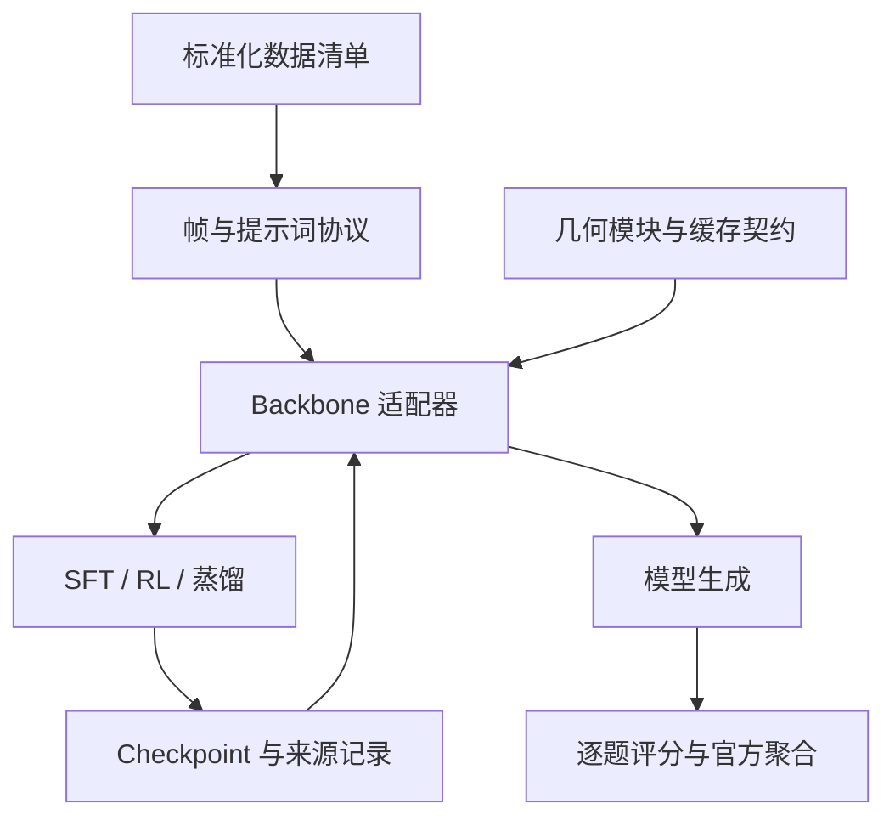

# 架构与扩展契约

## 1. 研究对象的拆分

将一次实验定义成六个可记录因素：

`数据清单 + 输入协议 + backbone + 几何方法 + 后训练目标 + 评测规则`。

这六个因素应独立变化。GeoWire/GeoBridge/GeoPSRO 的价值在于不同的几何建模与训练设计；公共框架负责让它们用相同的数据和评测条件进行可解释比较。



不要把 VGGT 特征、GeoWire 图和 GeoBridge continuity bank 强行转换成一个匿名 tensor；它们的语义、节点布局、坐标和构建目标不同。统一的是显式接口与缓存身份，不是随意统一张量形状。

## 2. 现有模块对应

| 统一职责 | 本版位置 | 历史实现 |
|---|---|---|
| 标准数据与无答案模型输入 | `data.py` | 三个仓库各自 manifest/dataset |
| 数据混合与预算 | `Mixture`, `training.py` | 历史 sampling/registry |
| Backbone 加载与 response 对齐 | `backends/hf.py` | Qwen 加载路径 |
| 图语义传输 | `backends/geowire.py` + 原始 GeoWire 类 | `GeoWireTransport`, `Qwen3VLGeoWireForConditionalGeneration` |
| 原方法训练兼容 | `legacy.py` | TIP、FCP、HGB、geometry-token SFT |
| 参数组合 | `cli.py:sweep` | 多份 shell 参数 |
| 训练目标 | `objectives.py` | QA CE、PSRO 规划配置等 |
| 推理记录 | `runner.py` | 原仓库部分缺失 |
| 通用与正式评分 | `evaluation.py`, `benchmarks.py` | 原 scoring/eval 脚本 |

## 3. 后端接口

推理后端最低需要：

```python
class NewBackend:
    def __init__(self, config, training=False): ...
    def generate(self, sample, protocol, seed):
        return {
            'response': '...',
            'input_tokens': 123,
            'completion_tokens': 16,
            'backend_status': '实际后端名',
        }
    def identity(self):
        return {'checkpoint_sha256': '...', 'revision': '...'}
```

将 YAML 的 `model.backend` 设置为 `my_package.my_backend:NewBackend`。适配器只能依赖传入的模型输入，不应读取另一个含标签的测试清单。

原生训练还需要这些成员：

| 成员 | 约定 |
|---|---|
| `model` | 可优化的 PyTorch module |
| `device` | 模型所在设备 |
| `tokenizer` | 对 completion 进行编码/解码 |
| `encode(sample, protocol, privileged=None)` | 返回单条 prompt 的模型输入；只有教师训练路径可传 privileged |
| `response_ids(text)` | `[1,T]`，包含 EOS |
| `response_logits(batch, ids)` | `[1,T,V]`，位置 t 预测 completion token t；允许梯度 |
| `sample_ids(batch, generation, seed)` | 当前学生在线采样的 `[1,T]` token IDs |
| `tokenizer_fingerprint()` | 分布蒸馏前验证 token 语义一致 |
| `save(path)` | 保存可恢复推理权重和 processor 信息 |

用于闭源 API 的后端通常只实现推理。没有 logits 的接口不能直接冒充 token-level OPD 教师。可以先输出教师文本，再做 offline KD。

验收 InternVL/LLaVA 的 HF 原生格式或接入其他 backbone 时，至少测试：图像 token 数量与 layout、chat template、generation prefix、EOS、padding、完整 response loss、保存加载，以及纯文本/多图/不同宽高比。当前共享接口的模型类型白名单不等同于真实权重全部验收。

## 4. 几何缓存契约

通用缓存身份应覆盖：

- dataset、sample/scene 身份，以及原始媒体字节哈希；
- 帧顺序、frame indices、时间戳及相机视角约定；
- resize/crop、processor、grid、token 排序、坐标单位；
- 几何 encoder checkpoint、版本、提取层；
- 构图参数、可见性/置信度阈值、cache schema 版本。

本版 GeoWire 适配器首先强制媒体、帧、图文件、尺寸上限和 image grid 一致。原 encoder 版本、重投影阈值等仍需在构图产物中保留；当前最小契约不自动证明这些几何参数正确。

Geometry on/off、随机图、跨视频替换、打乱时间都必须实际作用于模型输入；给输出 CSV 增加一个 `geometry_mode` 列不构成消融。

## 5. benchmark 插件

官方 scorer 签名：

```python
def official_scorer(rows, predictions, config):
    # 根据官方任务定义做解析、逐题评分、成对一致性及聚合。
    return {'status': '...', 'metrics': {...}, 'source_commit': '...'}
```

设置 `score.official_scorer=模块:函数`。评分器接收标签属于正常流程；生成后端接收标签则是数据泄漏。

必须保留官方代码来源和版本。若更新解析策略或阈值，应新建 scorer 版本。现有 scorer 指纹覆盖公共评分文件、插件源文件和所附 VSI 源文件；其他插件若继续调用外部文件，也应自行把这些依赖版本写入返回结果。

VSI 代码来自 [thinking-in-space 的固定 commit](https://github.com/vision-x-nyu/thinking-in-space/blob/51e089c3ae69b9435e9489058610f5b3964c56a8/lmms_eval/tasks/vsibench/utils.py)，保留原源文件和许可证。调用原解析、数值阈值与聚合函数，不自己重新猜测官方 MRA 实现。

## 6. 与分布式训练引擎接轨

v0.2 已提供 `distributed.py` 同步数据并行和分片推理；每步明确梯度归约、unused 参数与全局 finite 检查。资源语义见 [DISTRIBUTED](DISTRIBUTED.md)。

本版没有向 verl 注册模型，没有实现 vLLM 的自定义几何 rollout，也没有声称训练态 PyTorch 注入可以自动出现在 vLLM 中。

迁移至生产 RL/OPD 引擎时至少需要：

1. 训练 worker 和 rollout worker 加载相同 backbone、LoRA 与几何模块，比较相同输入下的 logprob。
2. rollout 同时保留图像/几何条件；跨 worker 不丢失帧与 cache key。
3. reward manager 使用明确的函数签名，group normalization、KL 方向与本版对齐。
4. distributed sampler 使用同一个全局排列；global batch、token budget 与 loss reduction 对齐。
5. 保存并恢复 optimizer、reference/teacher、RNG、sampler、global step，验证中断前后轨迹。

## 7. 版本与源码兼容

`legacy_sources` 是冻结快照，`sources.lock.json` 记录原 commit。包中已应用 `patches` 下的小补丁；不要再次向包内快照应用同一补丁。

若在原 Git 仓库应用：先切到独立分支，`git apply --check` 检查补丁，然后应用并跑回归；不同 commit 出现冲突时逐处检查，不能强行覆盖。

新公共代码采用限定范围的 MIT 许可，不重新许可三个历史仓库。保留上游文件头；VSI 第三方许可证随源文件保留。公开发布前核对历史归档的再分发权限，或只发布公共代码和 source fetcher。
